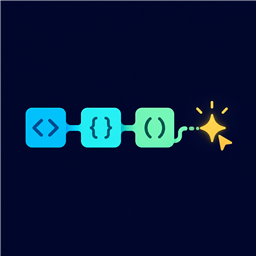

# Local N-Gram Code Suggester

Fast, private, comment-aware code completion that runs locally.

## Highlights

- Inline and IntelliSense completion without an account or subscription.
- Comments are excluded from code context and training.
- Variable-order n-grams with exact backoff instead of model-wide fuzzy scans.
- Bounded multi-token suggestions with Fast, Balanced, and Quality presets.
- Focused automatic frequency control and shorter five-token suggestions.
- Conservative cross-project learning from saved, error-free files. A pattern
  needs support from multiple projects and never outweighs the bundled model.
- Receiver-aware API member patterns and useful numeric expressions.
- Optional local project adaptation and free language-pack support.
- Local diagnostics with no telemetry.

Supported profiles: C#, Java, JavaScript, TypeScript, JSON/JSONC, Python,
JSX/TSX, Vue, and Razor.

Source, releases, and issue tracking:
[kevinski119/local-ngram-code-suggester](https://github.com/kevinski119/local-ngram-code-suggester).

## Offline model demo

The following animation is a deterministic Pillow-rendered editor simulation.
Its completion is queried from the bundled n-gram model; it is not an API
response or a recording containing personal desktop data.

Run **Local N-Gram: Show Model Diagnostics** to inspect the active model and
latency. Run **Local N-Gram: Manage Language Packs** to import a local pack or
use a configured trusted catalog. No pack is downloaded without user action.

## Privacy

Tokenization, completion, project context, and diagnostics stay on your
machine. Network access is limited to user-initiated pack catalog/download
operations or explicitly opted-in pack update checks.

Cross-project learning stays in VS Code global storage on this machine. It
stores hashed project identities, caps each project's contribution, ignores
files with reported errors, and requires multiple-project support before a
pattern can be suggested. Learned library identifiers are namespaced by detected
pip, npm, Java, or .NET imports and activate only when the same dependency is
present. Run **Local N-Gram: Clear Cross-Project Learning** at any time to erase
it.

## Attribution

Derived from Erik Klabukov's
[amest/vscode-ngram-code-suggester](https://github.com/amest/vscode-ngram-code-suggester)
under the MIT License. The
[original Marketplace listing](https://marketplace.visualstudio.com/items?itemName=nb47.vscode-ngram-suggester)
is maintained separately.

## License

MIT. See the included license.
